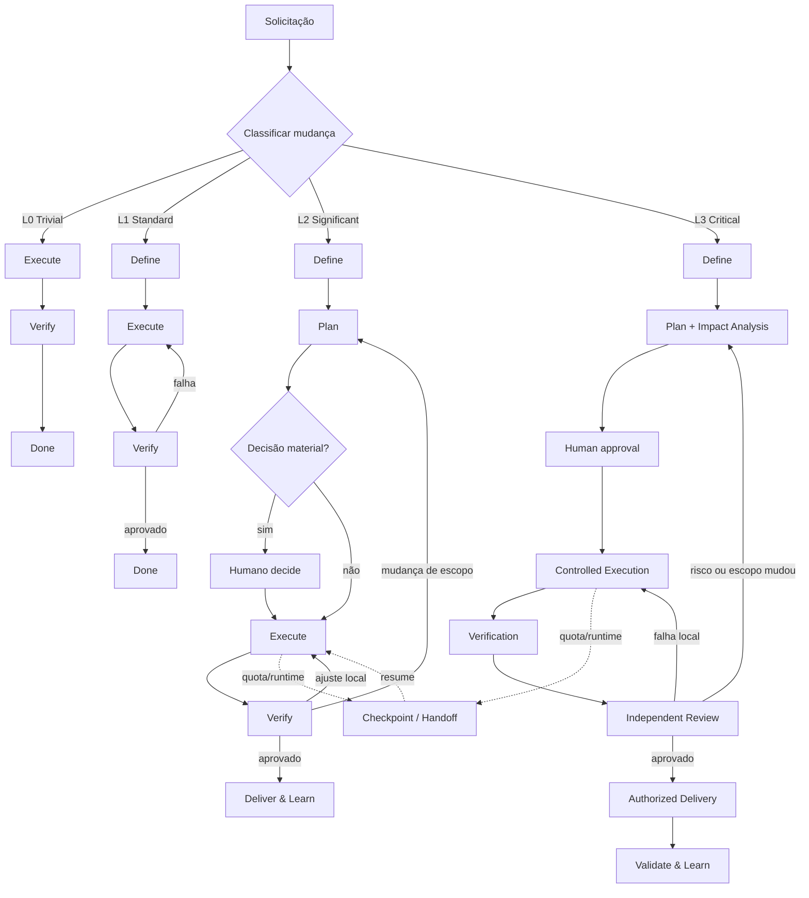

# AI-driven SDLC

**AI-driven SDLC** é um framework para desenvolvimento de software assistido por agentes, orientado por risco, evidências e continuidade entre diferentes modelos e runtimes.

Ele organiza o ciclo entre definição, planejamento, execução, verificação e entrega sem transformar cada mudança em um processo pesado. O princípio central é simples:

> **aplicar o menor nível de processo capaz de controlar adequadamente o risco da mudança.**

Claude Code, Codex e outros runtimes podem operar sobre o mesmo contexto de engenharia. Código, decisões, evidências e estado relevante permanecem fora do chat e podem ser retomados por outro executor.

## Objetivos

- estruturar trabalho de software sem depender do histórico de uma única sessão;
- adaptar o rigor ao risco, impacto, incerteza e reversibilidade;
- limitar execução autônoma sem criar aprovação humana para cada detalhe;
- exigir evidências antes de declarar uma mudança concluída;
- permitir handoff entre runtimes sem reiniciar a tarefa;
- separar implementação de verificação quando o risco justificar.

## Lifecycle

O modelo trabalha com cinco capacidades:

```text
DEFINE → PLAN → EXECUTE → VERIFY → DELIVER & LEARN
           ↑                    |
           └────── iterate ─────┘
```

Elas não são gates obrigatórios para todo trabalho. O perfil da mudança define quais capacidades e controles são necessários.

| Fase | Objetivo | Saída típica |
| --- | --- | --- |
| **Define** | Estabelecer objetivo, escopo, critérios de aceite e restrições | `spec.md` quando necessário |
| **Plan** | Definir solução, impactos, riscos, tarefas e estratégia de validação | `plan.md` quando necessário |
| **Execute** | Implementar dentro do escopo e dos limites definidos | código, commits e estado operacional |
| **Verify** | Validar comportamento, regressões e critérios de aceite | evidências e veredito |
| **Deliver & Learn** | Integrar, disponibilizar e incorporar feedback | `result.md` ou registro equivalente |

## Governança adaptativa

Antes de executar, o agente classifica a mudança. A classificação pode subir de nível quando surgirem novos riscos ou impactos.

| Perfil | Exemplos | Fluxo mínimo |
| --- | --- | --- |
| **L0 — Trivial** | documentação, rename, configuração local de baixo risco | Execute → Verify |
| **L1 — Standard** | bug localizado, pequena feature, manutenção previsível | Define → Execute → Verify |
| **L2 — Significant** | feature relevante, integração, mudança arquitetural local | Define → Plan → Execute → Verify → Deliver |
| **L3 — Critical** | segurança, pagamentos, dados sensíveis, migrações, alto blast radius | ciclo completo + análise de impacto + rastreabilidade + review independente |

### Critérios de classificação

Considere principalmente:

- impacto potencial;
- reversibilidade;
- incerteza técnica ou de produto;
- criticidade do domínio;
- quantidade de componentes afetados;
- risco de regressão;
- necessidade de coordenação entre executores.

A classificação não deve ser usada para inflar processo. Na dúvida entre dois níveis, escolha o menor nível que ainda preserve segurança e verificabilidade.

## Workflow por cenário



### Cenários operacionais

**Novo produto ou feature relevante**  
Classificar → Define → Plan → Execute → Verify → Deliver & Learn.

**Bug localizado**  
Reproduzir/entender → Execute → Verify. Subir para Plan se o diagnóstico revelar impacto mais amplo.

**Refactor**  
Definir invariantes → avaliar impacto → Execute → Verify equivalência. Review independente apenas quando risco justificar.

**Spike**  
Definir pergunta e limite → investigar → registrar evidências e recomendação. Spike não é implementação de produção.

**Handoff Claude ↔ Codex**  
Persistir somente o estado necessário → reconciliar branch/diff → continuar a mesma tarefa e o mesmo orçamento.

## Artefatos

O default é manter poucos artefatos canônicos:

| Artefato | Conteúdo |
| --- | --- |
| `spec.md` | problema, objetivo, escopo, aceite, restrições e dúvidas materiais |
| `plan.md` | abordagem, impactos, riscos, tarefas e estratégia de verificação |
| `result.md` | implementação, evidências, limitações, decisões e próximos passos |

Eles são **opcionais conforme o nível**. Uma alteração L0 não precisa criar três documentos para editar uma linha.

Artefatos adicionais são event-driven:

- ADR: decisão arquitetural relevante e durável;
- spike: incerteza que exige investigação;
- checkpoint/handoff: interrupção, troca de runtime ou tarefa longa;
- matriz de rastreabilidade: escopo crítico ou regulado;
- Issue/PR: quando colaboração, persistência, auditoria ou integração exigirem.

## Responsabilidades

O framework usa quatro responsabilidades principais:

| Responsabilidade | Função |
| --- | --- |
| **Shape** | compreender problema, requisitos, escopo e critérios de sucesso |
| **Build** | planejar tecnicamente e implementar |
| **Verify** | validar comportamento, evidências e qualidade |
| **Orchestrate** | controlar classificação, contexto, estado, routing, limites e handoffs |

Arquitetura, planejamento, análise de impacto e QA são **capabilities**, não agentes permanentes.

Papel, runtime e modelo são conceitos diferentes. Claude Code ou Codex podem exercer qualquer responsabilidade compatível com suas capacidades e permissões.

## Princípios de execução

1. **Inspecionar antes de assumir.** Repositório e evidências têm precedência sobre suposições.
2. **Processo proporcional ao risco.** Não gerar documentação ou approvals sem valor concreto.
3. **Escopo explícito.** Trabalho adjacente é reportado; não vira expansão silenciosa.
4. **Evidência antes de Done.** Testes, checks e critérios aplicáveis precisam ser demonstrados.
5. **Não enfraquecer controles.** O executor não altera testes, gates ou política apenas para obter aprovação.
6. **Intervenção humana por decisão, não por rotina.** Escalar decisões materiais, risco elevado, autorização externa ou orçamento esgotado.
7. **Persistência seletiva.** Registrar contexto que permita retomada; não criar ledger permanente de detalhes descartáveis.
8. **Review proporcional.** Independência é obrigatória em L3, recomendada em L2 de maior risco e opcional nos demais casos.

## Estado e continuidade

Git é a fonte de verdade para código, especificações e decisões versionadas. Issues e PRs podem manter coordenação e histórico quando úteis. O chat não é fonte de verdade.

Checkpoints são necessários quando:

- houver troca de runtime ou executor;
- a execução for interrompida;
- existir WIP difícil de reconstruir;
- uma tarefa longa atingir um marco relevante.

Um checkpoint deve registrar somente o necessário para retomada: tarefa, branch/commit, alterações pendentes, decisões relevantes, verificações executadas, falhas importantes, orçamento restante e próxima ação.

Handoff não reinicia orçamento nem apaga tentativas anteriores.

## Estrutura

```text
AGENTS.md                  # política comum
CLAUDE.md                  # entrada específica para Claude Code
docs/USAGE.md              # adoção e comandos de entrada
harness/START.md           # classificação e roteamento
harness/workflows/         # execução por cenário
harness/policies/          # orçamento e verificação
harness/roles/README.md    # responsabilidades
harness/adapters/          # particularidades dos runtimes
templates/workflow/        # spec, plan e result
templates/operations/      # configuração e handoff
```

## Estado atual

A V0 é composta por instruções e templates em Markdown. Ainda não existe controlador automático, scheduler, detecção automática de quota ou enforcement técnico dos gates.

A próxima evolução deve priorizar automação que reduza trabalho operacional: classificação assistida, geração seletiva de artefatos, reconciliação de estado, checks e handoff. Não automatizar cerimônias que o modelo adaptativo eliminou.

## Referências

O projeto combina conceitos de:

- [GitHub Spec Kit](https://github.com/github/spec-kit) — especificação e planejamento;
- [TaskForge](https://github.com/soeirosantos/taskforge) — execução limitada, gates e controles;
- Claude Code e Codex — runtimes intercambiáveis de execução.

A proposta deste projeto é adicionar uma camada comum de governança adaptativa, estado compartilhado e continuidade multi-modelo.
