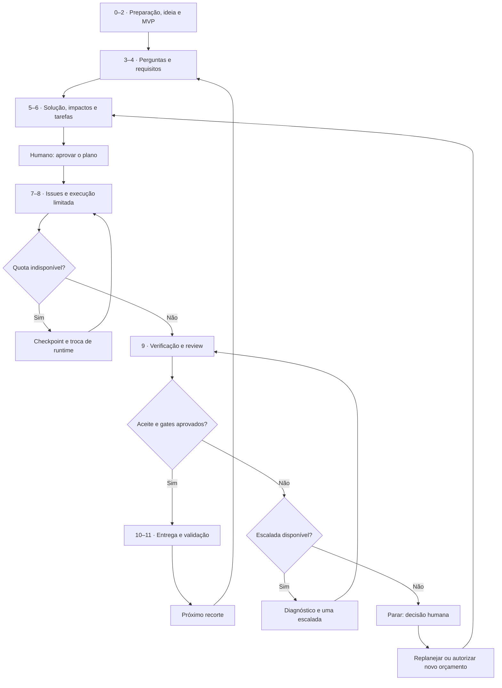

# AI-driven SDLC

Um modelo de ciclo de desenvolvimento de software conduzido por IA, com execução limitada, evidências verificáveis e intervenção humana nos momentos que exigem decisão.

**Da ideia ao software validado:** estruturar o problema, especificar comportamentos, analisar impactos, decompor o trabalho, coordenar agentes e preservar contexto entre Claude Code e Codex.

**Estado atual: V0 de instruções operacionais em Markdown.** Claude Code e Codex podem seguir entradas, workflows, políticas, papéis e templates em operação manual. Ainda não há controlador automático, hooks bloqueantes, medição automática de orçamento ou detecção de quota. A integração nativa com Spec Kit também não está instalada.

## Entradas operacionais do harness

Comece por [docs/USAGE.md](docs/USAGE.md). A política comum fica em [AGENTS.md](AGENTS.md); [CLAUDE.md](CLAUDE.md) encaminha Claude Code à mesma fonte. Arquivos referenciados devem ser lidos pelo agente conforme a atividade.

| Arquivo | Função |
| --- | --- |
| [START](harness/START.md) | Identificar intenção e selecionar o workflow |
| [Bootstrap](harness/workflows/bootstrap.md) | Configurar política e mapa de artefatos do produto |
| [Planning](harness/workflows/planning.md) | Discovery, perguntas, RF/RNF, impacto e tarefas |
| [Execution](harness/workflows/execution.md) | Issues, dispatch, estado e execução limitada |
| [Handoff](harness/workflows/handoff.md) | Retomar com contexto e orçamento preservados |
| [Maintenance](harness/workflows/maintenance.md) | Bug, refactor e spike proporcionais |
| [Budgets](harness/policies/budgets.md) | Tentativas, medição e escalada humana |
| [Verification](harness/policies/verification.md) | Evidências, review e Definition of Done |
| [Roles](harness/roles/README.md) | Responsabilidades e limites de cada papel |
| [Métodos](harness/integrations/methods.md) | O que reaproveitamos de Spec Kit e TaskForge |
| [Política do produto](templates/operations/project-policy.md) | Modelo de configuração e autorizações |
| [Checkpoint](templates/operations/checkpoint.md) | Modelo de contexto, posse e ledger |

## O que faz e como faz

| Necessidade | Como o modelo atende |
| --- | --- |
| Transformar uma ideia em algo construível | Discovery, perguntas relevantes, hipóteses explícitas, MVP e critérios de sucesso |
| Decompor trabalho | Especificações e tarefas com objetivo, escopo, aceite, risco e dependências |
| Entender o que uma mudança pode quebrar | Inspeção do código e relações de impacto vinculadas a evidências e regressões a verificar |
| Coordenar agentes | Papéis especializados, workflows e um orquestrador responsável pelo estado das tarefas |
| Usar Claude e Codex | Adaptadores de runtime e roteamento por capacidade, risco, disponibilidade e orçamento |
| Continuar quando a cota acabar | Checkpoints persistidos, handoff e retomada do mesmo orçamento de execução |
| Evitar sucesso inventado | Verificação determinística, review separado e aceite demonstrado |
| Saber quando parar | Limites por tentativa e escalada humana com diagnóstico e opções |

O projeto é um **Multi-model Agentic Software Development Harness**: uma camada de processo e controle em torno dos agentes de desenvolvimento.

## 1. Workflow 
O ciclo é executado por incrementos: primeiro um MVP ou uma feature, depois os próximos recortes. Um bug pode começar pelo diagnóstico, sem repetir todo o discovery.

| Etapa | Inputs / entradas | Outputs / saídas | Artefatos sugeridos | Papéis participantes | Condição de passagem |
| --- | --- | --- | --- | --- | --- |
| 0. Preparar o projeto | [Repositório, instruções existentes, ferramentas e autorizações](templates/workflow/00-preparacao.md#entrada) | [Contrato operacional e baseline](templates/workflow/00-preparacao.md#saída) | `docs/project-policy.md`; `docs/baseline.md` | Stakeholder/Responsável pelo projeto; Engenharia/Tech Lead; Orquestrador | Aprovar autonomia, orçamento e ações externas |
| 1. Capturar a ideia | [Descrição livre e contexto do usuário](templates/workflow/01-brief.md#entrada) | [Brief do problema](templates/workflow/01-brief.md#saída) | `docs/brief.md` | Stakeholder/Patrocinador; Produto/Product-shaper | Conferir entendimento |
| 2. Explorar e delimitar | [Brief, hipóteses e evidências](templates/workflow/02-discovery.md#entrada) | [MVP escolhido e alternativas](templates/workflow/02-discovery.md#saída) | `docs/discovery.md`; `docs/mvp.md` | Stakeholder; Produto/Product-shaper; Engenharia/Arquiteto de SW quando necessário | Humano escolhe direção e MVP |
| 3. Validar perguntas | [Dúvidas, hipóteses e decisões existentes](templates/workflow/03-perguntas.md#entrada) | [Respostas validadas e bloqueios](templates/workflow/03-perguntas.md#saída) | `docs/questions.md`; `docs/decisions/DEC-xxx.md` | Stakeholder; Produto; Engenharia/Arquiteto de SW; especialista do domínio quando necessário | Resolver perguntas bloqueantes da parte afetada |
| 4. Especificar requisitos | [MVP, respostas e hipóteses autorizadas](templates/workflow/04-requisitos.md#entrada) | [Spec com RFs, RNFs e aceite](templates/workflow/04-requisitos.md#saída) | `specs/BANK-001/spec.md` | Produto; Stakeholder; Engenharia/Arquiteto de SW; QA | Validar contrato do incremento |
| 5. Planejar solução e impactos | [Spec e baseline do repositório](templates/workflow/05-solucao-impactos.md#entrada) | [Plano técnico e mapa de riscos](templates/workflow/05-solucao-impactos.md#saída) | `specs/BANK-001/plan.md`; `specs/BANK-001/impacts.md`; `docs/decisions/DEC-xxx.md` | Engenharia/Arquiteto de SW; Tech Lead; Impact-analyzer; QA | Revisar decisões e riscos relevantes |
| 6. Decompor e revisar plano | [Spec, solução e impactos](templates/workflow/06-plano-tarefas.md#entrada) | [Tarefas, grafo e matriz de cobertura](templates/workflow/06-plano-tarefas.md#saída) | `specs/BANK-001/tasks.md`; `specs/BANK-001/traceability.md` | Engenharia/Planner; Arquiteto de SW; Produto; QA; Stakeholder | Humano aprova plano e orçamento |
| 7. Registrar e despachar | [Plano aprovado e tarefa pronta](templates/workflow/07-dispatch.md#entrada) | [Issue e pacote de execução](templates/workflow/07-dispatch.md#saída) | `GitHub Epic/Issue`; `.task-state/BANK-T02/dispatch.md` | Orquestrador; Engenharia/Implementer | Dependências satisfeitas e posse exclusiva |
| 8. Implementar com limites | [Issue, contexto e orçamento](templates/workflow/08-execucao.md#entrada) | [Mudanças, relatório e checkpoint](templates/workflow/08-execucao.md#saída) | `Código/commits`; `.task-state/BANK-T02/checkpoint.md` | Engenharia/Implementer; Orquestrador; especialista na escalada | Respeitar escopo e tentativas |
| 9. Verificar e revisar | [Diff, spec, aceite e relatório](templates/workflow/09-verificacao-review.md#entrada) | [Evidências e veredito](templates/workflow/09-verificacao-review.md#saída) | `specs/BANK-001/verification.md`; `PR/review` | QA; Reviewer/Engenharia; Orquestrador | Aceite, checks e review obrigatórios |
| 10. Integrar e entregar | [Mudança validada e autorizações](templates/workflow/10-entrega.md#entrada) | [PR integrado e incremento disponível](templates/workflow/10-entrega.md#saída) | `PR`; `docs/releases/BANK-001.md` | Engenharia; Orquestrador; responsável por release/Operações; Stakeholder quando exigido | Merge/deploy conforme política |
| 11. Validar e aprender | [Incremento e cenários de sucesso](templates/workflow/11-validacao-produto.md#entrada) | [Feedback e próximo recorte](templates/workflow/11-validacao-produto.md#saída) | `docs/validation/BANK-001.md`; `backlog/Issues` | Stakeholder/usuário avaliador; Produto; QA; Engenharia quando necessário | Humano avalia valor e experiência |

Os links de **inputs e outputs** apontam para as seções correspondentes de um template por etapa. Cada template contém campos de entrada/saída, artefatos sugeridos, participantes, condição de passagem e um exemplo curto. Os caminhos na coluna de artefatos representam instâncias sugeridas no repositório do produto; não são arquivos já preenchidos neste harness. Veja o [catálogo de templates](templates/workflow/README.md).

**Papéis representam responsabilidades.** Stakeholder/Patrocinador decide objetivos e prioridades; Produto organiza necessidades e valida valor; Engenharia/Arquiteto de SW define a solução; QA verifica comportamentos; Reviewer revisa de forma separada; Orquestrador controla estado e execução. Papéis técnicos e de Produto podem ser exercidos por agentes, pessoas ou ambos conforme a política. Uma pessoa pode acumular papéis, mas a revisão deve permanecer separada da implementação. A participação na etapa não significa que todos precisam aprovar cada ação; a coluna de passagem e a política de autonomia definem os momentos de decisão humana.

Perguntas podem reaparecer em qualquer etapa. Quota esgotada gera pausa e handoff dentro da tentativa vigente. Falha técnica pode gerar a única escalada disponível; seu esgotamento leva ao humano.



## 2. O que cada etapa faz

### 0. Preparar o projeto

**Entrada:** repositório novo ou existente e runtimes disponíveis.

O orquestrador identifica instruções existentes, estrutura, ferramentas e permissões. Define uma política comum para Claude Code e Codex: autonomia, escopo, tentativas, gates e condições de intervenção humana. Preserva configurações existentes; não sobrescreve instruções ou hooks sem análise.

Em projeto existente, descobre e executa os checks aplicáveis para estabelecer a baseline. Em projeto novo, registra o que não existe; a configuração de build e testes entra como trabalho explícito quando necessária.

**Saída:** contrato operacional do projeto e baseline conhecida. Nenhum check ausente é tratado como aprovado.

### 1. Capturar a ideia

**Entrada:** descrição livre do usuário.

O product-shaper organiza problema, público, motivação, resultado esperado, restrições, exemplos e não objetivos. Separa fatos fornecidos, hipóteses e dúvidas. Confirma o entendimento sem exigir uma solução técnica pronta.

**Saída:** brief persistido que explica o que queremos alcançar e por quê.

### 2. Explorar e delimitar o MVP

**Entrada:** brief e contexto disponível.

O agente compara opções de produto e implementação inicial, riscos, esforço e o aprendizado esperado. Pesquisa ou propõe um spike quando a decisão depende de evidência ainda inexistente. Define um recorte que possa ser demonstrado e validado.

**Saída:** MVP proposto, alternativas descartadas com motivo, hipóteses e critérios de sucesso. O humano escolhe a direção e as prioridades.

### 3. Levantar e validar perguntas

**Entrada:** brief, MVP e incertezas encontradas.

Primeiro o agente investiga dúvidas respondíveis pelo repositório ou documentação. Depois agrupa perguntas que exigem decisão humana. Cada pergunta tem ID, motivo, opções quando úteis, recomendação, responsável, status e itens afetados.

| Classificação | Tratamento |
| --- | --- |
| Bloqueante | Impede especificar ou executar a parte que depende da resposta |
| Não bloqueante | Pode seguir com hipótese explícita, reversível e autorizada |
| Técnica investigável | Inspeção, pesquisa ou spike com orçamento |
| Já respondida | Reutilizar a decisão registrada; não perguntar novamente sem motivo |

Validar a resposta significa conferir se ela resolve a dúvida, possui exemplos suficientes e não contradiz outra decisão. Uma resposta vaga pode exigir refinamento. Perguntas novas não obrigam reiniciar todo o processo.

**Saída:** registro de perguntas, respostas, decisões e hipóteses. Trabalho afetado por pergunta bloqueante não avança; trabalho independente pode seguir.

### 4. Especificar requisitos funcionais e não funcionais

**Entrada:** MVP escolhido, respostas e hipóteses autorizadas.

O agente descreve comportamentos, regras de negócio, casos de erro, invariantes e atributos de qualidade. Requisitos recebem IDs estáveis e critérios verificáveis.

| Tipo | O que descreve | Exemplo ilustrativo |
| --- | --- | --- |
| RF — funcional | Comportamento que o sistema oferece | RF-01: registrar e consultar uma operação bancária mockada |
| RNF — não funcional | Qualidade ou restrição da solução | RNF-01: reenvio do mesmo evento não duplica efeitos |
| Restrição | Limite obrigatório | Operações do protótipo não movimentam dinheiro real |

Performance, segurança, confiabilidade, privacidade, acessibilidade e observabilidade são avaliadas quando pertinentes. O agente não inventa SLA, volume ou exigências: propõe critérios e explicita o que precisa de decisão. “Rápido” e “seguro” precisam ser traduzidos em condições testáveis.

**Saída:** spec versionada e critérios de aceite. Mudança relevante no contrato aprovado exige análise de impacto e nova decisão.

### 5. Planejar a solução e analisar impactos

**Entrada:** requisitos e código existente.

Architect e impact-analyzer inspecionam arquitetura, contratos, dados, padrões e testes. Propõem uma solução proporcional, registram alternativas e decisões e identificam consumidores e comportamentos em risco. Em projeto novo, deixam claras as escolhas ainda não demonstradas.

| Relação | Significado |
| --- | --- |
| `depends_on` | Uma tarefa precisa de outra concluída |
| `impacts` | Uma mudança pode afetar comportamento ou requisito existente |
| `conflicts_with` | Execuções concorrentes podem disputar arquivos ou contratos |

Dependências formam um grafo sem ciclos para ordenar execução. Impactos podem ser cíclicos e registram evidência, confiança e regressões a verificar. O mapa é parcial e evolui conforme novas evidências surgem.

**Saída:** plano técnico, decisões, mapa de impactos e estratégia de verificação.

### 6. Decompor e validar a cobertura do plano

**Entrada:** spec e plano técnico.

O planner cria tarefas coerentes, limitadas e verificáveis. Não transforma cada edição ou comando em uma Issue. Trabalho grande é dividido; alta incerteza pode virar spike.

Cada tarefa contém objetivo, escopo, RFs/RNFs atendidos, critérios de aceite, dependências, impactos, conflitos, invariantes, perfil, orçamento e verificações. A classificação usa tipo, complexidade, risco, escopo e incerteza.

Uma matriz mantém a rastreabilidade:

| Requisito ilustrativo | Tarefas | Verificação |
| --- | --- | --- |
| RF-01: registrar operação | T-01 contrato; T-02 API/persistência | Registrar e consultar operação |
| RF-02: emitir recomendação | T-03 regras; T-04 interface | Simulação produz recomendação prevista |
| RNF-01: evitar duplicação | T-02 API; T-03 consumo | Reenviar evento mantém um único efeito |

Um requisito pode gerar várias tarefas; uma tarefa pode atender vários requisitos. RNFs podem ser critérios transversais. Tarefas técnicas devem justificar sua relação com requisitos, riscos ou infraestrutura necessária.

Antes da execução, revisar:
- Todo requisito incluído no recorte tem tarefa e evidência previstas.
- Não há tarefa sem justificativa nem requisito omitido silenciosamente.
- Perguntas bloqueantes da execução estão resolvidas.
- Dependências, conflitos, impactos e verificações são coerentes.
- A divisão cabe no orçamento e as ações estão autorizadas.

**Saída:** plano aprovado pelo humano, grafo de execução e matriz de cobertura. O review não exige decidir cada detalhe local.

### 7. Registrar no GitHub e despachar

**Entrada:** plano aprovado.

O orquestrador cria ou atualiza épicos e Issues, vincula IDs às specs e registra dependências. Só despacha tarefas prontas, com dependências concluídas, contexto disponível e ausência de bloqueios.

O pacote de execução inclui instruções comuns, objetivo, artefatos relevantes, escopo, aceite, orçamento e verificações. O entregável vem antes dos checks no prompt. O router escolhe runtime/modelo por capacidade, risco e disponibilidade; não impõe um fornecedor fixo para cada papel.

**Saída:** tarefa em execução, responsável exclusivo e estado reconciliado. Worktrees/branches e controle de posse evitam edições concorrentes inseguras.

### 8. Implementar dentro do orçamento

**Entrada:** tarefa e pacote de execução.

O worker implementa somente o escopo atribuído, roda verificações pertinentes e registra mudanças, decisões, resultados e dificuldades. Não delega recursivamente, altera controles ou fecha a própria tarefa.

Uma falha recebe no máximo uma escalada diagnóstica. Uma interrupção por quota transfere o estado e o orçamento restante para outro runtime. Checkpoints são persistidos durante o trabalho.

**Saída:** mudanças e relatório honesto, inclusive quando parcial. Ao esgotar tentativas, a tarefa vai para `needs_human`, com diagnóstico e dependentes bloqueados.

### 9. Verificar e revisar

**Entrada:** revisão entregue pelo worker, critérios e evidências.

O orquestrador executa os checks obrigatórios sobre a revisão correta. QA valida comportamento e regressões. O reviewer separado compara requisitos, diff, invariantes e evidências, inclusive a integridade dos testes.

Checks ausentes, falhando ou com timeout bloqueiam Done. Testes verdes não substituem aceite. Correções de review permanecem sujeitas ao orçamento da tarefa; não abrem um loop novo ilimitado.

**Saída:** aceite demonstrado e review aprovado, ou diagnóstico para correção/escalada.

### 10. Integrar e entregar

**Entrada:** mudança validada e autorizações registradas.

O orquestrador prepara PR com problema, comportamento entregue, requisitos atendidos, validação e riscos materiais. Confere a revisão que será integrada, resolve conflitos dentro do escopo e repete os checks necessários quando o código muda.

Merge e deploy seguem a política do projeto. Aprovação de plano não implica autorização automática para publicar produção.

**Saída:** incremento integrado e disponível no ambiente autorizado. Issues só são encerradas quando a definição de conclusão estiver satisfeita.

### 11. Validar o produto e aprender

**Entrada:** incremento utilizável.

O humano avalia experiência e valor, não apenas correção técnica. O agente registra feedback, hipóteses confirmadas ou rejeitadas, limitações e oportunidades.

**Saída:** aceite do incremento ou ajustes explicitamente classificados. Novo comportamento retorna aos requisitos; defeito vai ao workflow de bug; o próximo recorte reaproveita decisões existentes.

## 3. How to — como usar o projeto

### Situação atual

Este repositório fornece instruções operacionais e templates. Ainda não fornece instalador, comandos próprios ou execução automática. O uso inicial é **manual, com os agentes seguindo os arquivos do harness e os artefatos no Git**. Veja [o guia operacional](docs/USAGE.md). Os prompts abaixo são instruções de uso; não são comandos implementados.

### Passo 1 — Preparar o repositório do produto

Use estas regras no repositório do produto que será desenvolvido. Leia suas instruções existentes e integre a política comum, sem sobrescrevê-las. Separe instruções compartilhadas das específicas de Claude Code ou Codex.

Defina autonomia, verificações e orçamento. Em projeto existente, peça:

```text
Inspecione este repositório e proponha a configuração do nosso AI-driven SDLC.
Identifique instruções existentes, arquitetura, ferramentas e verificações.
Registre baseline, lacunas e política proposta de autonomia/tentativas.
Não implemente funcionalidades nem sobrescreva configurações existentes.
```

A integração com Spec Kit deve usar uma versão fixada e os caminhos/templates correspondentes. Ela ainda não está instalada por este projeto.

### Passo 2 — Apresentar a ideia em planejamento

Se usar Claude Code, o Plan Mode pode conduzir exploração e planejamento. Nossas regras definem os resultados esperados. O mesmo contrato deve funcionar com Codex. Não gere um plano paralelo independente por runtime.

```text
Quero um protótipo de banco advisor em uma interface semelhante ao WhatsApp.
Operações bancárias serão mockadas; quero simular movimentações e recomendações.
Siga as etapas de discovery do AI-driven SDLC.
Organize o problema, explore alternativas e proponha um MVP.
Separe fatos, hipóteses e dúvidas. Investigue o que puder antes de me perguntar.
Não implemente ainda.
```

### Passo 3 — Responder perguntas e escolher o MVP

Revise perguntas agrupadas, decida o recorte e confirme restrições. Não é necessário responder todo detalhe técnico antecipadamente.

```text
Vamos seguir com interface simulada e operações mockadas.
O advisor será o componente que queremos validar.
Registre essas decisões e confira se resolvem as perguntas bloqueantes.
Liste somente as decisões relevantes ainda pendentes.
```

### Passo 4 — Pedir a especificação e o plano rastreável

```text
Produza a spec do MVP escolhido com RFs e RNFs identificados.
Inspecione o repositório antes de propor a solução.
Mapeie impactos, riscos, dependências e conflitos.
Decomponha tarefas com critérios de aceite e verificações.
Inclua a matriz requisito → tarefa → evidência.
Pare para revisão do plano; não implemente.
```

Revise cobertura, riscos e dúvidas, e ajuste o artefato existente. Uma dúvida sobre T-03 deve atualizar T-03 e os itens afetados; não exige regenerar tudo.

### Passo 5 — Aprovar e registrar a execução

```text
Aprovo este plano e a execução das tarefas dentro do escopo.
Registre épico, Issues e dependências no GitHub.
Use uma tentativa inicial e até uma escalada por tarefa.
Registre o perfil e o orçamento aprovado de cada tarefa.
Execute sequencialmente as tarefas prontas.
Merge e deploy continuam sujeitos à política registrada do projeto.
```

Nesta fase manual, criar Issues exige ferramenta conectada ou CLI autenticada. Sem acesso, prepare os textos para registro e declare o bloqueio; não alegue que as Issues foram criadas.

### Passo 6 — Executar e acompanhar evidências

O executor recebe uma tarefa por vez. O orquestrador mantém estado e orçamento, verifica o resultado e encaminha ao reviewer. O usuário intervém apenas nos pontos previstos.

Para acompanhar, peça:

```text
Mostre tarefas concluídas, em execução e bloqueadas.
Para cada conclusão, vincule critérios de aceite e evidências.
Liste decisões que precisam de mim com opções e recomendação.
```

### Passo 7 — Trocar de runtime quando necessário

Antes da troca voluntária, salve checkpoint e alterações acessíveis ao próximo executor. Em interrupção abrupta, reconcilie o último checkpoint com git diff e resultados disponíveis.

```text
Retome a tarefa indicada no handoff.
Leia instruções comuns, Issue, spec, plano e checkpoint.
Confirme branch, commit, diff e término do executor anterior.
Continue a tentativa vigente com o orçamento restante.
Não reinicie tentativas nem repita abordagens descartadas.
```

### Passo 8 — Revisar, entregar e validar

Revise a evidência e o PR. Autorize integração/publicação quando necessário. Use o incremento e forneça feedback ligado aos cenários definidos.

```text
Valide a cobertura de RFs/RNFs e os critérios do incremento.
Prepare o PR com evidências e riscos materiais.
Após a integração autorizada, registre resultado e pendências.
Separe defeitos de novas necessidades e proponha o próximo recorte.
```

O primeiro exercício recomendado é uma feature pequena de ponta a ponta, incluindo uma retomada manual entre runtimes. Ela valida o processo antes de automatizar o orquestrador.

## Humano no loop: quando entrar

O humano decide o que construir, aceita riscos e resolve impasses. O agente conduz o trabalho dentro do escopo autorizado.

| Momento | Intervenção humana |
| --- | --- |
| Direção e MVP | Aprovar problema, prioridades, limites e critérios de sucesso |
| Plano inicial | Aprovar escopo, decisões relevantes e política de execução |
| Ambiguidade material | Resolver dúvida que altera produto, contrato, segurança, custo ou compatibilidade e não foi resolvida por inspeção |
| Risco fora da autorização | Decidir sobre ação destrutiva, migração irreversível, exposição de dados ou novo compromisso financeiro |
| Mudança de controles | Revisar proposta que altera gates, orçamento ou regras de execução |
| Tentativas esgotadas | Receber diagnóstico e escolher replanejar, reduzir escopo, fornecer informação ou autorizar novo orçamento |
| Integração e entrega | Aprovar quando a política exigir; validar o comportamento final do produto |

Escolhas locais, reversíveis e cobertas pelo plano não exigem perguntas repetidas. Ao parar, o agente explica a decisão necessária, apresenta evidências e recomenda opções. Tarefas dependentes ficam bloqueadas; tarefas independentes podem continuar se houver autorização e isolamento seguro.

## Limites de tentativas: como funciona no TaskForge

Na versão consultada em **05/10/2026**, o TaskForge configura:

| Perfil | Limite por execução | Após falhar ou esgotar |
| --- | --- | --- |
| `worker-haiku` | `maxTurns: 8` | Uma escalada para Opus |
| `worker-sonnet` | `maxTurns: 15` | Uma escalada para Opus |
| `escalation-opus` | `maxTurns: 15` | Parada e intervenção humana |

Uma tarefa pode começar diretamente no perfil Opus com justificativa no plano. Nesse caso, sua falha vai direto ao humano.

**Tentativa é uma execução limitada do worker.** Dentro dela podem ocorrer diagnóstico, edições e múltiplas verificações. O limite de turnos controla a duração da interação do agente; não significa “15 testes” nem “15 soluções diferentes”.

Isso limita custo e loops improdutivos, obriga a reconhecer bloqueios e evita que o agente amplie o escopo ou enfraqueça o aceite para declarar sucesso. Não garante qualidade: uma tarefa mal decomposta pode esgotar o limite sem chegar à verificação.

### Como introduzir no nosso modelo

Adotar **uma tentativa inicial + no máximo uma escalada diagnóstica**. A escalada recebe o histórico e precisa explicar por que a abordagem anterior falhou antes de editar. Se a tarefa já começar no perfil de escalada, não há segunda tentativa autônoma.

Os limites abaixo são uma proposta inicial configurável, não um padrão já implementado:

```yaml
execution_policy:
  initial_attempts: 1
  escalation_attempts: 1
  profiles:
    simple: { max_agent_turns: 8 }
    standard: { max_agent_turns: 15 }
    escalation: { max_agent_turns: 15 }
  on_exhaustion: needs_human
  reset_budget_on_runtime_switch: false
```

Os adaptadores devem impor limites reais. Quando um runtime não expõe turnos equivalentes, o orquestrador precisa definir e aplicar limites de tempo, chamadas ou custo; não deve alegar equivalência automática com `maxTurns`. Limites de custo só são aplicáveis quando o runtime oferece medição confiável.

O orçamento inclui correções pedidas por verificações e review. Reiniciar sessão, trocar modelo, abrir outra Issue para o mesmo problema ou invocar “convergência” não renova tentativas. Uma nova rodada exige decisão humana registrada com motivo e novo orçamento.

Falha de infraestrutura ou indisponibilidade gera pausa e checkpoint. Não é automaticamente falha de raciocínio, mas também não devolve recursos já consumidos. Quota esgotada permite transferência da tentativa em andamento; não cria uma escalada adicional.

O ledger registra tarefa, tentativa, perfil, runtime, recursos consumidos, resultado, abordagens tentadas e próxima ação. Ao esgotar o orçamento, o agente entrega mudanças parciais e diagnóstico honesto; não declara sucesso.

## Regras de integridade incorporadas

As seguintes regras reaproveitam os controles do TaskForge e os tornam independentes do runtime:

1. **Inspecionar antes de presumir.** Resolver dúvidas com evidências do projeto; documentar hipóteses e escalar ambiguidades materiais. Não inventar requisitos.
2. **Respeitar escopo e invariantes.** Problemas adjacentes são reportados para triagem; não viram trabalho ilimitado.
3. **Separar execução de certificação.** Worker reporta; orquestrador verifica e controla o ciclo de vida; reviewer avalia o resultado.
4. **Não burlar testes.** Não remover asserts, pular testes, esconder falhas, reduzir cobertura exigida ou alterar dados esperados apenas para ficar verde. Mudanças legítimas em testes precisam decorrer do requisito e ser revisadas.
5. **Proteger controles.** Tarefas de aplicação não alteram hooks, gates, políticas ou configuração de verificação para conseguir aprovação. Evoluir o harness exige tarefa própria e revisão humana.
6. **Falhar de forma fechada.** Check obrigatório ausente, impossível de executar, falhando ou com timeout bloqueia Done. Falhas preexistentes são registradas e tratadas; não são silenciosamente dispensadas.
7. **Exigir evidência real.** Registrar comando, resultado, revisão de código verificada e critérios atendidos. “Deve funcionar” não é resultado.
8. **Impedir delegação recursiva e retries ocultos.** Somente o orquestrador despacha workers e controla tentativas.

O gate do TaskForge exige a suíte completa de testes unitários. Aqui, o conjunto obrigatório é definido por projeto e tipo de tarefa: mudanças de código usam os checks existentes e testes pertinentes; documentação pode usar checks de Markdown e links. A política é definida antes da execução e não pode ser reduzida pelo worker. Em projeto novo, configurar verificações é trabalho explícito; ausência de testes não pode aparecer como “testes passaram”.

## Papéis, workflows e modelos

| Papel | Responsabilidade |
| --- | --- |
| Product-shaper | Estruturar a ideia, alternativas, hipóteses e MVP |
| Architect | Desenhar contratos, limites e decisões técnicas |
| Impact-analyzer | Mapear áreas afetadas e regressões possíveis |
| Planner | Decompor, classificar e ordenar tarefas |
| Implementer | Executar uma tarefa limitada |
| QA | Produzir evidências de comportamento e regressão |
| Reviewer | Revisar aceite, diff, invariantes e integridade dos checks |
| Orquestrador | Controlar estado, posse, dispatch, orçamento, gates e handoffs |

Papéis são responsabilidades; não exigem oito sessões permanentes. **Papel, runtime e modelo são conceitos diferentes:** implementer é o papel; Claude Code ou Codex é o runtime; o modelo é a opção disponível dentro dele.

O router escolhe por capacidade, risco, complexidade, incerteza e disponibilidade. Não fixa “Claude planeja, Codex programa” como regra universal. Preferência e fallback são configuráveis. Um reviewer separado recebe contexto suficiente para revisar sem depender do veredito do autor; usar outro modelo é desejável quando disponível, mas não substitui checks.

| Workflow | Caminho resumido |
| --- | --- |
| Novo projeto/feature | Discovery quando necessário → spec → arquitetura/impactos → plano → execução → QA/review → entrega |
| Bug | Reproduzir → diagnosticar → mapear impacto → corrigir → verificar sintoma e regressão → review |
| Refactor | Definir invariantes → mapear consumidores → planejar migração → implementar → verificar equivalência → review |
| Spike | Definir pergunta e orçamento → investigar → registrar evidências e recomendação |

## Estado compartilhado e handoff Claude ↔ Codex

**Git guarda código, especificações e decisões versionadas. GitHub Issues guarda fila, bloqueios, responsáveis e histórico operacional. PRs guardam a proposta de integração e sua revisão.** O chat não é a fonte de verdade do projeto.

Cada Issue referencia o ID da tarefa e a revisão dos artefatos. Relações de dependência podem usar recursos nativos do GitHub quando disponíveis; impactos e conflitos ficam explícitos nos metadados. IDs e atualizações idempotentes evitam duplicação de tarefas. O orquestrador reconcilia divergências antes de despachar trabalho.

Estados propostos: `planned → ready → in_progress → verifying → in_review → done`, com `blocked`, `paused` e `needs_human` quando necessário. Fechar uma Issue não equivale a passar um gate: o controlador precisa validar a transição para Done.

Checkpoints acontecem em marcos úteis e antes de uma troca voluntária de runtime. Como uma cota pode terminar sem aviso, o estado precisa ser persistido durante o trabalho, não somente no final.

Um handoff contém:

- Tarefa/Issue, spec e plano aprovados, objetivo e aceite pendente.
- Branch, commit base, commits feitos e alterações ainda não commitadas.
- Decisões, hipóteses, riscos, arquivos alterados e abordagens que falharam.
- Comandos executados, resultados e quais evidências continuam válidas.
- Tentativa atual, orçamento consumido/restante e motivo da transferência.
- Próxima ação concreta e identificação do executor que deixou a tarefa.

Alterações parciais devem ser preservadas em commit WIP isolado ou patch acessível ao próximo runtime. Não se presumem disponíveis em outra máquina. Segredos não entram em Issues ou handoffs.

Exemplo de retomada:

```text
Retome a tarefa BANK-003, ligada à Issue indicada no handoff.
Leia as instruções comuns, a spec, o plano e o checkpoint.
Confira branch, commit e diff; reconcilie o estado antes de editar.
Continue a tentativa existente com o orçamento restante.
Não repita abordagens descartadas nem altere os critérios de aceite.
```

## Estrutura proposta e primeira versão

```text
AGENTS.md                  # Política comum; adaptadores referenciam esta fonte
CLAUDE.md                  # Instruções específicas do runtime Claude Code
docs/vision.md             # Problema, público, objetivos e MVP
docs/decisions/            # Decisões e justificativas
specs/<feature>/           # Spec, plano, tarefas e análise de impacto
harness/policies/          # Autonomia, tentativas e verificação
harness/roles/             # Contratos dos papéis
harness/workflows/         # Fluxos por tipo de trabalho
harness/adapters/          # Claude Code, Codex e GitHub
.task-state/               # Checkpoints e ledger, sem segredos
.github/                   # Templates e checks de integração
```

Esta estrutura é ilustrativa. A integração com Spec Kit deve reaproveitar os caminhos e templates da versão adotada, evitando duas cópias concorrentes da mesma especificação.

**V0 entregue em instruções:** entradas comuns e por runtime, workflows, papéis, políticas e templates operacionais. Issues, execução sequencial, orçamento, handoff e review são conduzidos manualmente; ainda precisam ser validados em uma feature pequena. Os adaptadores atuais são documentos operacionais, não integrações executáveis.

Depois, automatizar dispatch, reconciliação de estado, gates e transferências. Detecção automática de quota e paralelismo dependem das capacidades dos runtimes e entram somente após validar continuidade e isolamento.

O Spec Kit fornece a base de especificação e planejamento; o TaskForge inspira os controles de execução; este projeto acrescenta estado compartilhado, análise de impacto e continuidade entre runtimes. Regras sobrepostas devem ficar em uma política comum, com precedência clara sobre instruções de papéis e tarefas. O loop de implementação/convergência também fica sujeito ao orçamento.

## Referências

Fontes consultadas em 05/10/2026. Os projetos evoluem; antes de integrar, fixar a versão/commit e conferir licença e compatibilidade. Este README adapta conceitos; não incorpora código desses projetos.

- [Spec Kit](https://github.com/github/spec-kit): processos, artefatos e extensibilidade.
- [TaskForge README](https://github.com/soeirosantos/taskforge/blob/main/README.md): planejamento e execução limitada.
- [TaskForge política de execução](https://github.com/soeirosantos/taskforge/blob/main/CLAUDE.md): lifecycle, gates, escalada e proteção do harness.
- [TaskForge planejamento](https://github.com/soeirosantos/taskforge/blob/main/.claude/TASK_PLANNING_INSTRUCTIONS.md): decomposição, riscos, ambiguidades e dependências.
- [Worker Haiku](https://github.com/soeirosantos/taskforge/blob/main/.claude/agents/worker-haiku.md), [Worker Sonnet](https://github.com/soeirosantos/taskforge/blob/main/.claude/agents/worker-sonnet.md) e [Escalada Opus](https://github.com/soeirosantos/taskforge/blob/main/.claude/agents/escalation-opus.md): limites e obrigações dos workers.
