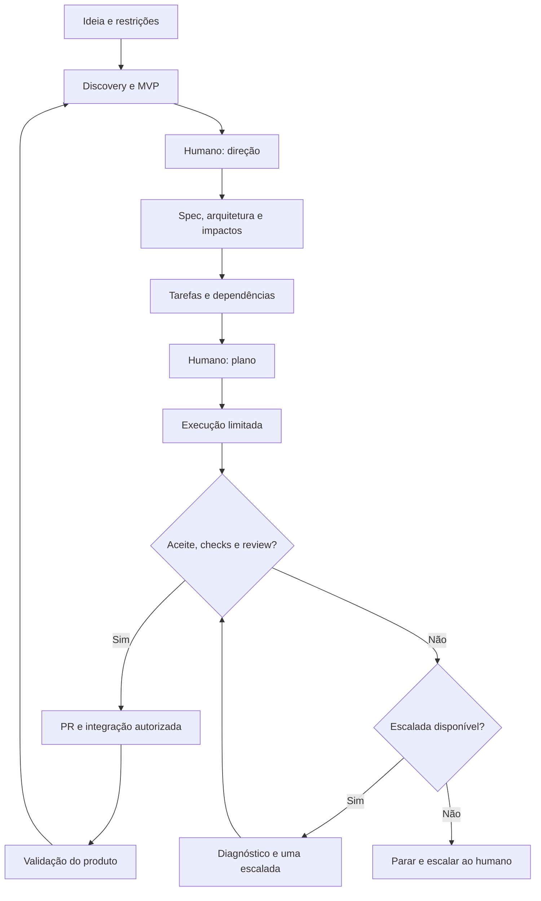

# AI-driven SDLC

Um modelo de ciclo de desenvolvimento de software conduzido por IA, com execução limitada, evidências verificáveis e intervenção humana nos momentos que exigem decisão.

**Da ideia ao software validado:** estruturar o problema, especificar comportamentos, analisar impactos, decompor o trabalho, coordenar agentes e preservar contexto entre Claude Code e Codex.

**Estado atual: proposta de arquitetura e fluxo.** Este README define o funcionamento desejado. Ainda não há orquestrador, integrações, hooks ou automação implementados neste repositório. Os prompts abaixo ilustram o uso futuro e podem orientar uma operação manual inicial.

## O que faz e como faz

| Necessidade | Como o modelo atende |
| --- | --- |
| Transformar uma ideia em algo construível | Discovery, perguntas relevantes, hipóteses explícitas, MVP e critérios de sucesso |
| Decompor trabalho | Especificações e tarefas com objetivo, escopo, aceite, risco e dependências |
| Entender o que uma mudança pode quebrar | Inspeção do código e relações de impacto vinculadas a evidências e regressões a verificar |
| Coordenar agentes | Papéis especializados, workflows e um orquestrador responsável pelo estado das tarefas |
| Usar Claude e Codex | Adaptadores de runtime e roteamento por capacidade, risco, disponibilidade e orçamento |
| Continuar quando a cota acabar | Checkpoints persistidos, handoff e retomada do mesmo orçamento de execução |
| Evitar sucesso inventado | Verificação determinística, review separado e aceite demonstrado |
| Saber quando parar | Limites por tentativa e escalada humana com diagnóstico e opções |

O projeto é um **Multi-model Agentic Software Development Harness**: uma camada de processo e controle em torno dos agentes de desenvolvimento.

## Tenho uma ideia. Como uso esse modelo?

### 1. Apresentar a ideia e definir a autonomia

O usuário descreve o problema, o público, o resultado esperado e as restrições conhecidas. Não precisa chegar com uma especificação pronta.

Exemplo:

```text
Quero um protótipo de banco com advisor em uma interface semelhante ao WhatsApp.
Operações bancárias serão mockadas. Quero simular movimentações e testar recomendações.
Primeiro estruture a ideia, explore opções e proponha um MVP.
Registre hipóteses e pergunte sobre decisões que mudem produto, custo ou risco.
```

O modelo também registra a política de autonomia: quais decisões técnicas pode tomar, quais ações externas estão autorizadas e quais exigem aprovação. Uma autorização já concedida não deve ser solicitada novamente sem mudança relevante de contexto.

### 2. Estruturar e explorar

O papel de **product-shaper** organiza problema, usuários, jornadas, objetivos, não objetivos, restrições, hipóteses, alternativas e critérios de sucesso. Pesquisa ou spikes curtos ajudam a resolver incertezas antes de comprometer a implementação.

O humano decide sobre a direção do produto e o MVP. Hipóteses não viram fatos silenciosamente; perguntas são agrupadas para evitar interrupções a cada detalhe.

Saída: visão do projeto e um primeiro recorte aprovado para construir.

### 3. Especificar o comportamento

O agente transforma o recorte em requisitos observáveis, exemplos, casos de erro, invariantes e critérios de aceite. O Spec Kit é a base proposta para os artefatos de especificação, planejamento e tarefas.

O fluxo de avaliação de ideias do Spec Kit é uma extensão opcional. Sua saída pode alimentar a especificação; não é uma etapa obrigatória de todo trabalho.

Saída: uma especificação versionada. Ambiguidades materiais precisam de decisão antes de executar a parte afetada.

### 4. Inspecionar o projeto, desenhar a solução e mapear impactos

Antes de planejar mudanças, o agente lê o repositório: arquitetura, interfaces, modelos, padrões, testes e comandos reais de verificação. Em um projeto novo, identifica o que ainda precisa ser criado e quais decisões continuam abertas.

Os papéis de **architect** e **impact-analyzer** propõem a solução, registram alternativas e identificam dependências, riscos e comportamentos existentes que precisam continuar funcionando.

| Relação | Significado | Exemplo |
| --- | --- | --- |
| `depends_on` | Uma tarefa exige a conclusão de outra | Advisor depende do contrato de eventos |
| `impacts` | Uma mudança pode afetar um comportamento existente | Alterar eventos pode quebrar a classificação de gastos |
| `conflicts_with` | Execuções simultâneas podem disputar arquivos ou contratos | Duas tarefas alteram o mesmo schema |

Dependências formam um grafo sem ciclos para ordenar a execução. Relações de impacto podem ser cíclicas e precisam indicar evidência, grau de confiança e verificações propostas. A IA não consegue garantir que descobriu todos os impactos; o mapa é atualizado com novas evidências.

### 5. Decompor, classificar e publicar o plano

O **planner** cria unidades coerentes, pequenas o suficiente para um worker e grandes o suficiente para produzir um resultado verificável. Abrir arquivo e rodar formatter são passos internos, não tarefas independentes.

Cada tarefa registra:

- Tipo: feature, bug, refactor, infra, test, spike, doc ou tech-debt.
- Complexidade: XS, S, M, L ou XL; risco: baixo, médio, alto ou crítico.
- Escopo: local, módulo, múltiplos módulos ou sistema; incerteza: baixa, média ou alta.
- Objetivo, limites, invariantes, aceite, dependências, impactos e conflitos.
- Perfil de execução, justificativa, orçamento, reviewer e verificações.

Trabalho grande demais é decomposto; incerteza alta pode exigir um spike. Paralelismo só é permitido quando dependências, arquivos e contratos permitem integração segura.

**O humano revisa o plano antes da primeira execução.** O plano aprovado vira épicos e tarefas no GitHub Issues, com referências às especificações versionadas. Novos recortes relevantes voltam ao planejamento.

### 6. Executar tarefas prontas

O **orquestrador** seleciona uma tarefa sem bloqueios, registra o responsável e despacha um worker com objetivo, contexto mínimo, aceite e orçamento. O entregável vem antes dos passos de verificação no prompt.

O worker implementa somente o escopo recebido, verifica o resultado e reporta evidências. Não delega recursivamente nem encerra sua própria tarefa.

O orquestrador evita duas sessões escrevendo na mesma tarefa: usa posse exclusiva de execução, branches/worktrees quando necessário e integração controlada. Trocar de runtime exige interromper ou confirmar o término do executor anterior.

### 7. Verificar, revisar e integrar

O orquestrador executa as verificações exigidas sobre a revisão entregue, sem confiar apenas no relato do worker. Um reviewer separado confronta o diff com a especificação, os invariantes e os critérios de aceite.

**Done exige aceite demonstrado + verificações obrigatórias aprovadas + review exigido pela política.** Testes verdes, isoladamente, não comprovam que o comportamento pedido foi entregue.

O resultado segue para PR, integração e fechamento da Issue conforme a política de aprovação. Merge, publicação e deploy obedecem às autorizações registradas. Um novo commit invalida evidências que precisem ser repetidas.

### 8. Validar o resultado e escolher o próximo recorte

O humano avalia o comportamento do produto, especialmente experiência e utilidade. O modelo registra aprendizados, atualiza decisões e impactos e propõe o próximo incremento. Feedback que muda requisitos retorna à especificação e ao plano.



## Humano no loop: quando entrar

O humano decide o que construir, aceita riscos e resolve impasses. O agente conduz o trabalho dentro do escopo autorizado.

| Momento | Intervenção humana |
| --- | --- |
| Direção e MVP | Aprovar problema, prioridades, limites e critérios de sucesso |
| Plano inicial | Aprovar escopo, decisões relevantes e política de execução |
| Ambiguidade material | Resolver dúvida que altera produto, contrato, segurança, custo ou compatibilidade e não foi resolvida por inspeção |
| Risco fora da autorização | Decidir sobre ação destrutiva, migração irreversível, exposição de dados ou novo compromisso financeiro |
| Mudança de controles | Revisar proposta que altera gates, orçamento ou regras de execução |
| Tentativas esgotadas | Receber diagnóstico e escolher replanejar, reduzir escopo, fornecer informação ou autorizar novo orçamento |
| Integração e entrega | Aprovar quando a política exigir; validar o comportamento final do produto |

Escolhas locais, reversíveis e cobertas pelo plano não exigem perguntas repetidas. Ao parar, o agente explica a decisão necessária, apresenta evidências e recomenda opções. Tarefas dependentes ficam bloqueadas; tarefas independentes podem continuar se houver autorização e isolamento seguro.

## Limites de tentativas: como funciona no TaskForge

Na versão consultada em **05/10/2026**, o TaskForge configura:

| Perfil | Limite por execução | Após falhar ou esgotar |
| --- | --- | --- |
| `worker-haiku` | `maxTurns: 8` | Uma escalada para Opus |
| `worker-sonnet` | `maxTurns: 15` | Uma escalada para Opus |
| `escalation-opus` | `maxTurns: 15` | Parada e intervenção humana |

Uma tarefa pode começar diretamente no perfil Opus com justificativa no plano. Nesse caso, sua falha vai direto ao humano.

**Tentativa é uma execução limitada do worker.** Dentro dela podem ocorrer diagnóstico, edições e múltiplas verificações. O limite de turnos controla a duração da interação do agente; não significa “15 testes” nem “15 soluções diferentes”.

Isso limita custo e loops improdutivos, obriga a reconhecer bloqueios e evita que o agente amplie o escopo ou enfraqueça o aceite para declarar sucesso. Não garante qualidade: uma tarefa mal decomposta pode esgotar o limite sem chegar à verificação.

### Como introduzir no nosso modelo

Adotar **uma tentativa inicial + no máximo uma escalada diagnóstica**. A escalada recebe o histórico e precisa explicar por que a abordagem anterior falhou antes de editar. Se a tarefa já começar no perfil de escalada, não há segunda tentativa autônoma.

Os limites abaixo são uma proposta inicial configurável, não um padrão já implementado:

```yaml
execution_policy:
  initial_attempts: 1
  escalation_attempts: 1
  profiles:
    simple: { max_agent_turns: 8 }
    standard: { max_agent_turns: 15 }
    escalation: { max_agent_turns: 15 }
  on_exhaustion: needs_human
  reset_budget_on_runtime_switch: false
```

Os adaptadores devem impor limites reais. Quando um runtime não expõe turnos equivalentes, o orquestrador precisa definir e aplicar limites de tempo, chamadas ou custo; não deve alegar equivalência automática com `maxTurns`. Limites de custo só são aplicáveis quando o runtime oferece medição confiável.

O orçamento inclui correções pedidas por verificações e review. Reiniciar sessão, trocar modelo, abrir outra Issue para o mesmo problema ou invocar “convergência” não renova tentativas. Uma nova rodada exige decisão humana registrada com motivo e novo orçamento.

Falha de infraestrutura ou indisponibilidade gera pausa e checkpoint. Não é automaticamente falha de raciocínio, mas também não devolve recursos já consumidos. Quota esgotada permite transferência da tentativa em andamento; não cria uma escalada adicional.

O ledger registra tarefa, tentativa, perfil, runtime, recursos consumidos, resultado, abordagens tentadas e próxima ação. Ao esgotar o orçamento, o agente entrega mudanças parciais e diagnóstico honesto; não declara sucesso.

## Regras de integridade incorporadas

As seguintes regras reaproveitam os controles do TaskForge e os tornam independentes do runtime:

1. **Inspecionar antes de presumir.** Resolver dúvidas com evidências do projeto; documentar hipóteses e escalar ambiguidades materiais. Não inventar requisitos.
2. **Respeitar escopo e invariantes.** Problemas adjacentes são reportados para triagem; não viram trabalho ilimitado.
3. **Separar execução de certificação.** Worker reporta; orquestrador verifica e controla o ciclo de vida; reviewer avalia o resultado.
4. **Não burlar testes.** Não remover asserts, pular testes, esconder falhas, reduzir cobertura exigida ou alterar dados esperados apenas para ficar verde. Mudanças legítimas em testes precisam decorrer do requisito e ser revisadas.
5. **Proteger controles.** Tarefas de aplicação não alteram hooks, gates, políticas ou configuração de verificação para conseguir aprovação. Evoluir o harness exige tarefa própria e revisão humana.
6. **Falhar de forma fechada.** Check obrigatório ausente, impossível de executar, falhando ou com timeout bloqueia Done. Falhas preexistentes são registradas e tratadas; não são silenciosamente dispensadas.
7. **Exigir evidência real.** Registrar comando, resultado, revisão de código verificada e critérios atendidos. “Deve funcionar” não é resultado.
8. **Impedir delegação recursiva e retries ocultos.** Somente o orquestrador despacha workers e controla tentativas.

O gate do TaskForge exige a suíte completa de testes unitários. Aqui, o conjunto obrigatório é definido por projeto e tipo de tarefa: mudanças de código usam os checks existentes e testes pertinentes; documentação pode usar checks de Markdown e links. A política é definida antes da execução e não pode ser reduzida pelo worker. Em projeto novo, configurar verificações é trabalho explícito; ausência de testes não pode aparecer como “testes passaram”.

## Papéis, workflows e modelos

| Papel | Responsabilidade |
| --- | --- |
| Product-shaper | Estruturar a ideia, alternativas, hipóteses e MVP |
| Architect | Desenhar contratos, limites e decisões técnicas |
| Impact-analyzer | Mapear áreas afetadas e regressões possíveis |
| Planner | Decompor, classificar e ordenar tarefas |
| Implementer | Executar uma tarefa limitada |
| QA | Produzir evidências de comportamento e regressão |
| Reviewer | Revisar aceite, diff, invariantes e integridade dos checks |
| Orquestrador | Controlar estado, posse, dispatch, orçamento, gates e handoffs |

Papéis são responsabilidades; não exigem oito sessões permanentes. **Papel, runtime e modelo são conceitos diferentes:** implementer é o papel; Claude Code ou Codex é o runtime; o modelo é a opção disponível dentro dele.

O router escolhe por capacidade, risco, complexidade, incerteza e disponibilidade. Não fixa “Claude planeja, Codex programa” como regra universal. Preferência e fallback são configuráveis. Um reviewer separado recebe contexto suficiente para revisar sem depender do veredito do autor; usar outro modelo é desejável quando disponível, mas não substitui checks.

| Workflow | Caminho resumido |
| --- | --- |
| Novo projeto/feature | Discovery quando necessário → spec → arquitetura/impactos → plano → execução → QA/review → entrega |
| Bug | Reproduzir → diagnosticar → mapear impacto → corrigir → verificar sintoma e regressão → review |
| Refactor | Definir invariantes → mapear consumidores → planejar migração → implementar → verificar equivalência → review |
| Spike | Definir pergunta e orçamento → investigar → registrar evidências e recomendação |

## Estado compartilhado e handoff Claude ↔ Codex

**Git guarda código, especificações e decisões versionadas. GitHub Issues guarda fila, bloqueios, responsáveis e histórico operacional. PRs guardam a proposta de integração e sua revisão.** O chat não é a fonte de verdade do projeto.

Cada Issue referencia o ID da tarefa e a revisão dos artefatos. Relações de dependência podem usar recursos nativos do GitHub quando disponíveis; impactos e conflitos ficam explícitos nos metadados. IDs e atualizações idempotentes evitam duplicação de tarefas. O orquestrador reconcilia divergências antes de despachar trabalho.

Estados propostos: `planned → ready → in_progress → verifying → in_review → done`, com `blocked`, `paused` e `needs_human` quando necessário. Fechar uma Issue não equivale a passar um gate: o controlador precisa validar a transição para Done.

Checkpoints acontecem em marcos úteis e antes de uma troca voluntária de runtime. Como uma cota pode terminar sem aviso, o estado precisa ser persistido durante o trabalho, não somente no final.

Um handoff contém:

- Tarefa/Issue, spec e plano aprovados, objetivo e aceite pendente.
- Branch, commit base, commits feitos e alterações ainda não commitadas.
- Decisões, hipóteses, riscos, arquivos alterados e abordagens que falharam.
- Comandos executados, resultados e quais evidências continuam válidas.
- Tentativa atual, orçamento consumido/restante e motivo da transferência.
- Próxima ação concreta e identificação do executor que deixou a tarefa.

Alterações parciais devem ser preservadas em commit WIP isolado ou patch acessível ao próximo runtime. Não se presumem disponíveis em outra máquina. Segredos não entram em Issues ou handoffs.

Exemplo de retomada:

```text
Retome a tarefa BANK-003, ligada à Issue indicada no handoff.
Leia as instruções comuns, a spec, o plano e o checkpoint.
Confira branch, commit e diff; reconcilie o estado antes de editar.
Continue a tentativa existente com o orçamento restante.
Não repita abordagens descartadas nem altere os critérios de aceite.
```

## Estrutura proposta e primeira versão

```text
AGENTS.md                  # Política comum; adaptadores referenciam esta fonte
CLAUDE.md                  # Instruções específicas do runtime Claude Code
docs/vision.md             # Problema, público, objetivos e MVP
docs/decisions/            # Decisões e justificativas
specs/<feature>/           # Spec, plano, tarefas e análise de impacto
harness/policies/          # Autonomia, tentativas e verificação
harness/roles/             # Contratos dos papéis
harness/workflows/         # Fluxos por tipo de trabalho
harness/adapters/          # Claude Code, Codex e GitHub
.task-state/               # Checkpoints e ledger, sem segredos
.github/                   # Templates e checks de integração
```

Esta estrutura é ilustrativa. A integração com Spec Kit deve reaproveitar os caminhos e templates da versão adotada, evitando duas cópias concorrentes da mesma especificação.

**V0:** templates de ideia/spec/tarefa, política comum, Issues vinculadas, mapa simples de dependências/impactos, execução sequencial, handoff manual, controle de tentativas e verificação/review antes de Done. Primeiro validar esse processo em uma feature pequena.

Depois, automatizar dispatch, reconciliação de estado, gates e transferências. Detecção automática de quota e paralelismo dependem das capacidades dos runtimes e entram somente após validar continuidade e isolamento.

O Spec Kit fornece a base de especificação e planejamento; o TaskForge inspira os controles de execução; este projeto acrescenta estado compartilhado, análise de impacto e continuidade entre runtimes. Regras sobrepostas devem ficar em uma política comum, com precedência clara sobre instruções de papéis e tarefas. O loop de implementação/convergência também fica sujeito ao orçamento.

## Referências

Fontes consultadas em 05/10/2026. Os projetos evoluem; antes de integrar, fixar a versão/commit e conferir licença e compatibilidade. Este README adapta conceitos; não incorpora código desses projetos.

- [Spec Kit](https://github.com/github/spec-kit): processos, artefatos e extensibilidade.
- [TaskForge README](https://github.com/soeirosantos/taskforge/blob/main/README.md): planejamento e execução limitada.
- [TaskForge política de execução](https://github.com/soeirosantos/taskforge/blob/main/CLAUDE.md): lifecycle, gates, escalada e proteção do harness.
- [TaskForge planejamento](https://github.com/soeirosantos/taskforge/blob/main/.claude/TASK_PLANNING_INSTRUCTIONS.md): decomposição, riscos, ambiguidades e dependências.
- [Worker Haiku](https://github.com/soeirosantos/taskforge/blob/main/.claude/agents/worker-haiku.md), [Worker Sonnet](https://github.com/soeirosantos/taskforge/blob/main/.claude/agents/worker-sonnet.md) e [Escalada Opus](https://github.com/soeirosantos/taskforge/blob/main/.claude/agents/escalation-opus.md): limites e obrigações dos workers.
